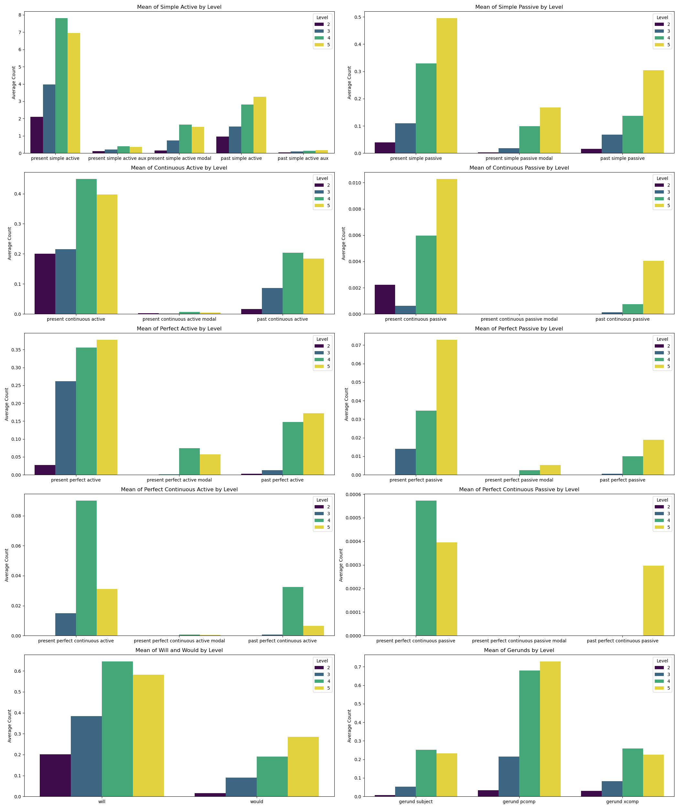
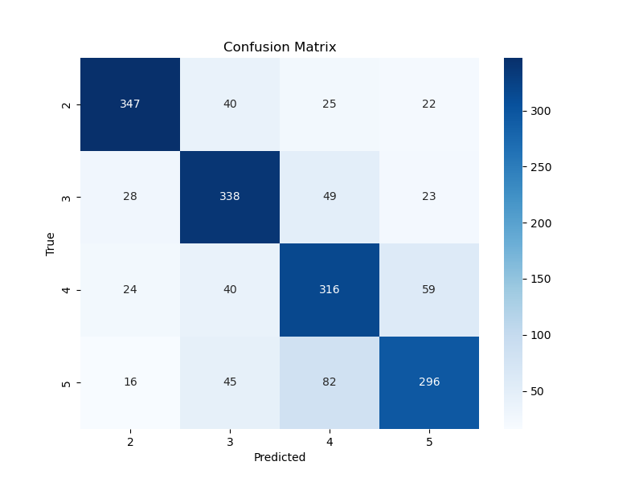
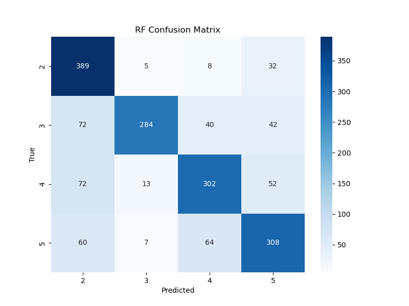

# ESL Writing Classification

The latest version of deployed model is on the <a href="https://gradespeare.streamlit.app/" target="_blank">GradeSpeare</a> app.

- [Overview](#overview)
- [Datasets](#datasets)
- [Compilation and Cleaning](#compilation-and-cleaning)
- [Augmentation and Balancing](#augmentation-and-balancing)
- [NLP - Dependency Matching and Doc Vectors](#nlp---dependency-matching-and-doc-vectors)
- [Model Selection](#model-selection)
- [References](#references)

## Overview

This is my capstone project for the <a href="https://www.concordiabootcamps.ca/lp/data-science-lp-2?utm_term=data%20science%20course&utm_campaign=Search_MTL&utm_source=adwords&utm_medium=ppc&hsa_acc=3838886679&hsa_cam=21258988525&hsa_grp=159297764102&hsa_ad=698842094834&hsa_src=g&hsa_tgt=kwd-27111326778&hsa_kw=data%20science%20course&hsa_mt=b&hsa_net=adwords&hsa_ver=3&gad_source=1&gclid=Cj0KCQjwmMayBhDuARIsAM9HM8cIwxytsOtn7U2dY3yU9LpthFIRA6TdJUJIYlJ55XLvv580bPaAh50aAtfmEALw_wcB" target="_blank">Concordia Data Science Diploma program.</a> Its goal is to create a model that can predict the level of a written text according to the <a href="https://www.coe.int/en/web/common-european-framework-reference-languages/level-descriptions#:~:text=The%20CEFR%20organises%20language%20proficiency,needs%20of%20the%20local%20context." target="_blank">CEFR</a>.

The current model is a multi-layer perceptron (MLP) classifier, and it predicts the level with 75% overall accuracy. It was trained on 5,943 texts from the <a href="https://github.com/ELI-Data-Mining-Group/PELIC-dataset/" target="_blank">PELIC</a> dataset, 194 texts from the <a href="https://cental.uclouvain.be/team/atack/cefr-asag/">ASAG</a> dataset, and 862 artificially augmented texts. The level that is predicted is a combination of the 'level_id' variable from the PELIC dataset, and the 'grade_majority_vote' variable from the ASAG dataset. 'level_id' indicates the level of the English course that the writer was taking at the time of production. 'grade_majority_vote' indicates the majority vote of three grades given by trained TOEFL examiners.

## Datasets
<ol>
  <li>The University of Pittsburgh English Language Institute Corpus (<a href ="https://github.com/ELI-Data-Mining-Group/PELIC-dataset/" target="_blank">PELIC</a>, Juffs 2020)</li>
  <li>Université Catholique de Louvain - CEFR Automated Short Answer Grading (<a href='https://cental.uclouvain.be/team/atack/cefr-asag/' target="_blank">ASAG</a>, Tack et al.)</li>
</ol>

<b>PELIC</b> and <b>ASAG</b> compiled datasets are stored as .pkl files in the <a href="https://github.com/jdolane/ESL_Writing_Classification/tree/main/data" target="_blank">data</a> folder. The pickle format was chosen to conserve the datatype format of the 'doc_vector' column, which is converted to a string in .csv.

## Compilation and Cleaning

<a href="https://github.com/jdolane/ESL_Writing_Classification/tree/main/notebooks/compile" target="_blank">Compilation</a> and <a href="https://github.com/jdolane/ESL_Writing_Classification/tree/main/notebooks/clean" target="_blank">cleaning</a> steps are demonstrated in .ipynb files in their respective subfolders in the <a href="https://github.com/jdolane/ESL_Writing_Classification/tree/main/notebooks" target="_blank">notebooks</a> folder.

The <b>PELIC</b> dataset consists of five .csv files that were merged with Pandas. The dataset initially consisted of 47,667 rows and 47 columns. The two main variables that were used in training the model were 'answer', which is the student's written text, and 'level_id', which is the level of the course that the student was taking at the time of writing.

Null values and texts of insufficient quality were removed from the dataset in such a way as to conserve as much data as possible. First, different versions of the same texts were removed, as they were essentially duplicates. Next, the answers from different course types and question types were inspected to see which questions allowed for an open text answer (many of the questions in the dataset only allowed for a selection answer, which wouldn't provide good data). It was found that all course and question types could be conserved, and only answers that were not produced in an open text field were removed.

After that, null values needed to be taken care of. Before dropping null values from the entire dataset, columns containing fewer than 36,304 answers were removed. These columns consisted of several variables such as birth year, gender, and test scores. It was considered that test scores could also be used as potential 'y' variables; however, keeping them in the dataset would have reduced the number of texts - it was decided that 'level_id' would serve as the data label.

The <b>ASAG</b> dataset consists of 299 .xml files that were scraped using <b>BeautifulSoup</b>. The questions, answers, and grades in this dataset are very clear and didn't need to be cleaned.

Instead of choosing a minimum answer length, <b>spaCy</b> was used to filter out answers that did not contain at least one subject and one verb. This allowed for the conservation of data from level 2, and eliminated one-word responses and multiple-choice answers. No maxiumum answer length was set.

| Dataset | Rows Before Cleaning | Rows After Cleaning |
|---------|-----------------|----------------|
| PELIC | 47,667 | 31,099 |
| ASAG | 299 | 268 |

## Augmentation and Balancing

The <b>PELIC</b> dataset was very imbalanced by level. To address this issue, the level 2 class was doubled using GPT2Tokenizer and GPT2LMHeadModel. The texts were augmented by using AI to rephrase and generate a continuation of each answer. The second half of the AI generated texts were then truncated to get the augmented data sample. The generator uses top-k and nucleus sampling, which helps to retain the style of the text. It was considered that a simpler augmentation technique could be used, such as random shuffling and insertion, or synonym replacement; however, this wouldn't have conserved the grammatical structure of the answers, which is needed to be able to match patterns. The augmentation function is found in <a href="https://github.com/jdolane/ESL_Writing_Classification/blob/main/notebooks/augment/Augment.ipynb" target="_blank">Augment.ipynb</a>

Once the answers of the level 2 class were augmented, the answers from the remaining classes (3, 4, and 5) were reduced. The reduction was not random; rather, a function was used to choose the longest answers first, and to not choose an answer from the same question twice, where possible, until the data was balanced. The balancing function is found in the notebooks in the <a href="https://github.com/jdolane/ESL_Writing_Classification/tree/main/notebooks/balance" target="_blank">balancing</a> folder.

### Value counts of level before and after augmentation and balancing
| Dataset | Level | Original Count | Count After Augmentation | Count After Balancing |
|---------|-------|----------------|--------------------------|-----------------------|
| PELIC | 4  |  12,163 | 12,163 | 1,698 |
| PELIC | 5  |  10,094 | 10,094 | 1,698 |
| PELIC | 3 | 7,993 | 7,993 | 1,698 | 
| PELIC | 2 | 849 | 1,698 | 1,698 |
| ASAG | 3 | 97 | 97 | 56 |
| ASAG | 4 | 67 | 67 | 56 |
| ASAG | 2 | 54 | 56 | 56 |
| ASAG | 5 | 28 | 56 | 56 |

## NLP - Dependency Matching and Doc Vectors

spaCy's doc.vector function was used to generate 300-dimensional document vectors, which were included in X. No lemmatization, stop word, or punctuation removal was done prior to vectorization. The reason for this decision was to preserve the grammatical integrity of the documents for classification, since what is being classified is not a topic, but a level of complexity.

Patterns for 26 verb tense combinations, 3 gerund dependencies, and two modal verbs were defined using spaCy's DependencyMatcher. The count of these patterns, along with the number of sentences and the average sentence length per answer, were calculated. The dependency patterns were squared before adding them to X to increase their chance of being detected during model training. The average sentence length was added to X raw, and the number of sentences was excluded from X (the sheer number of sentences wasn't expected to be a good indicator of level).

Patterns were created and combined using the functions in the <a href="https://github.com/jdolane/ESL_Writing_Classification/tree/main/notebooks/pattern_matching">pattern_matching</a> notebook folder. The pattern dictionary is in a <a href="https://github.com/jdolane/ESL_Writing_Classification/blob/main/patterns/patterns.json">.json file</a> in the patterns folder.

The following verbal structures were searched for. A search with auxiliaries ("aux") is included where appropriate to include negatives. Searches with modals ("modal") exclude the lemmas <i>will</i> and <i>would</i> so that these could be searched for separately:

| Tense    | Aspect | Voice   | Aux <i>do</i> | Modal |
|----------|--------|---------|-----|-------|
| Present  | Simple | Active  | ✓ | ✓   |
| Present  | Simple | Passive |   | ✓   |
| Present  | Continuous | Active  |   | ✓   |
| Present  | Continuous | Passive |   | ✓   |
| Present  | Perfect | Active  |   | ✓   |
| Present  | Perfect | Passive |   | ✓   |
| Present  | Perfect-Continuous | Active |   | ✓   |
| Present  | Perfect-Continuous | Passive |   | ✓   |
| Past     | Simple | Active  | ✓ |    |
| Past     | Simple | Passive |   |     |
| Past     | Continuous | Active  |   |     |
| Past     | Continuous | Passive |   |    |
| Past     | Perfect | Active  |   |     |
| Past     | Perfect | Passive |   |    |
| Past     | Perfect-Continuous | Active |   |    |
| Past     | Perfect-Continuous | Passive |   |    |

| Tag | Dependency | 
|-----------|---------|
| Gerund | Subject |
| Gerund | Complement of a Preposition |
| Gerund | Open Complement |

| Tag | Lemma |
|-----|-------|
| Modal | <i>will</i> |
| Modal | <i>would</i> |

### Average counts of top features per answer

| Feature                      | Level 2 | Level 3 | Level 4 | Level 5 |
|------------------------------|---------|---------|---------|---------|
| present simple active        | 2.097   | 3.976   | 7.805   | 6.954   |
| past simple active           | 0.958   | 1.534   | 2.805   | 3.263   |
| <i>will</i>                         | 0.202   | 0.385   | 0.645   | 0.581   |
| present continuous active    | 0.200   | 0.216   | 0.449   | 0.398   |
| presen simple active modal  | 0.153   | 0.737   | 1.646   | 1.516   |
| present simple active aux    | 0.110   | 0.202   | 0.404   | 0.358   |
| present perfect active       | -       | 0.262   | 0.356   | 0.377   |
| gerund pcomp                 | -       | 0.214   | 0.680   | 0.728   |
| present simple passive       | -       | 0.110   | 0.330   | 0.495   |
| gerund xcomp                 | -       | -       | 0.259   | 0.226   |
| gerund subject               | -       | -       | 0.253   | 0.233   |
| past continuous active       | -       | -       | 0.204   | 0.184   |
| <i>would</i>                        | -       | -       | 0.191   | 0.285   |
| past perfect active          | -       | -       | 0.148   | 0.172   |
| past simple passive          | -       | 0.110   | 0.137   | 0.304   |
| past simple active aux       | -       | -       | 0.135   | 0.172   |
| present simple passive modal | -       | -       | -       | 0.168   |

### A visual summary

## Model Selection

Class | Level description  | CEFR level
:---     | :---               | :---
2        | Pre-Intermediate   | A2/B1
3        | Intermediate       | B1
4	       | Upper-Intermediate | B1+/B2
5	       | Advanced           | B2+/C1

### MLP Classifier
Four different algorithms have been used to classify the data with y being 'level_id' for the PELIC dataset and 'grade_majority_vote' for the ASAG dataset. The performace metrics of each model are below, in descending order by performance.

#### Overall Accuracy: 0.74

| Class | Precision | Recall | F1-Score |
|-------|-----------|--------|----------|
| 2    | 0.84   |   0.80   |   0.82     |
| 3 | 0.73   |   0.77   |   0.75 |
| 4 | 0.67   |   0.72    |  0.69 |
| 5    |   0.74   |   0.67  |    0.71 |
| weighted avg   |    0.74  |    0.74   |   0.74 |

### Random Forest
#### Overall Accuracy: 0.73

| Class | Precision | Recall | F1-Score |
|-------|-----------|--------|----------|
| 2    |   0.66  |    0.90   |   0.76 |
| 3   |   0.92  |    0.65   |   0.76 |
| 4    |   0.73   |   0.69   |   0.71 |
| 5   |    0.71  |    0.70   |   0.71 |
| weighted avg   |    0.75   |   0.73   |   0.73 |

### Linear SVC
#### Overall Accuracy: 0.61

| Class | Precision | Recall | F1-Score |
|-------|-----------|--------|----------|
| 2    |   0.72   |   0.86   |   0.78 |
| 3    |   0.51   |   0.70   |   0.59 |
| 4    |   0.52   |   0.17   |   0.25 |
| 5    |   0.65   |   0.72   |   0.68 |
| weighted avg    |  0.60   |   0.61  |    0.58 |

### Logistic Regression
#### Overall Accuracy: 0.51

| Class | Precision | Recall | F1-Score |
|-------|-----------|--------|----------|
| 2    |   0.68  |    0.80   |   0.74 |
| 3    |   0.40   |   0.67   |   0.50 |
| 4   |    0.57   |   0.17   |   0.26 |
| 5    |   0.47   |   0.40  |    0.43 |
| weighted avg   |    0.53   |   0.51   |   0.48 |

## References

- Juffs, A., Han, N-R., & Naismith, B. (2020). The University of Pittsburgh English Language Corpus (PELIC) [Data set]. <a href="http://doi.org/10.5281/zenodo.3991977" target="_blank">http://doi.org/10.5281/zenodo.3991977</a>
- Tack, Anaïs, Thomas François, Sophie Roekhaut, and Cédric Fairon. (2017) "Human and Automated CEFR-based Grading of Short Answers." In Proceedings of the 12th Workshop on Innovative Use of NLP for Building Educational Applications, pp. 169-179. Association for Computational Linguistics, 2017. [Paper](https://www.aclweb.org/anthology/W17-5018) [DOI](https://doi.org/10.18653/v1/W17-5018)

